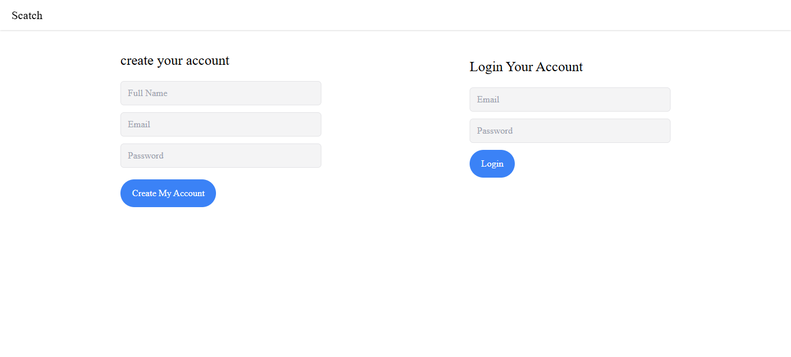
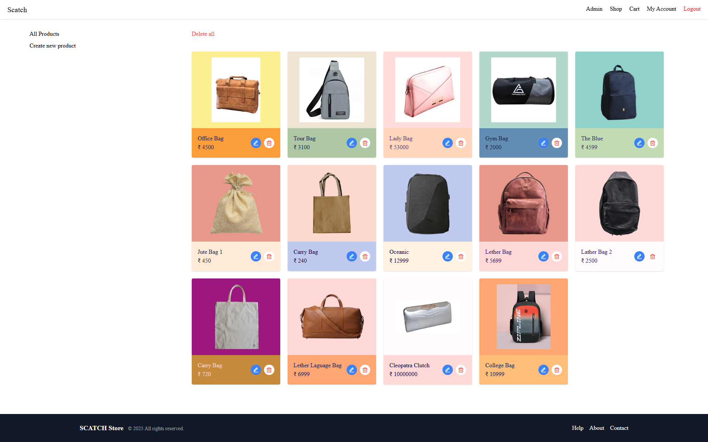
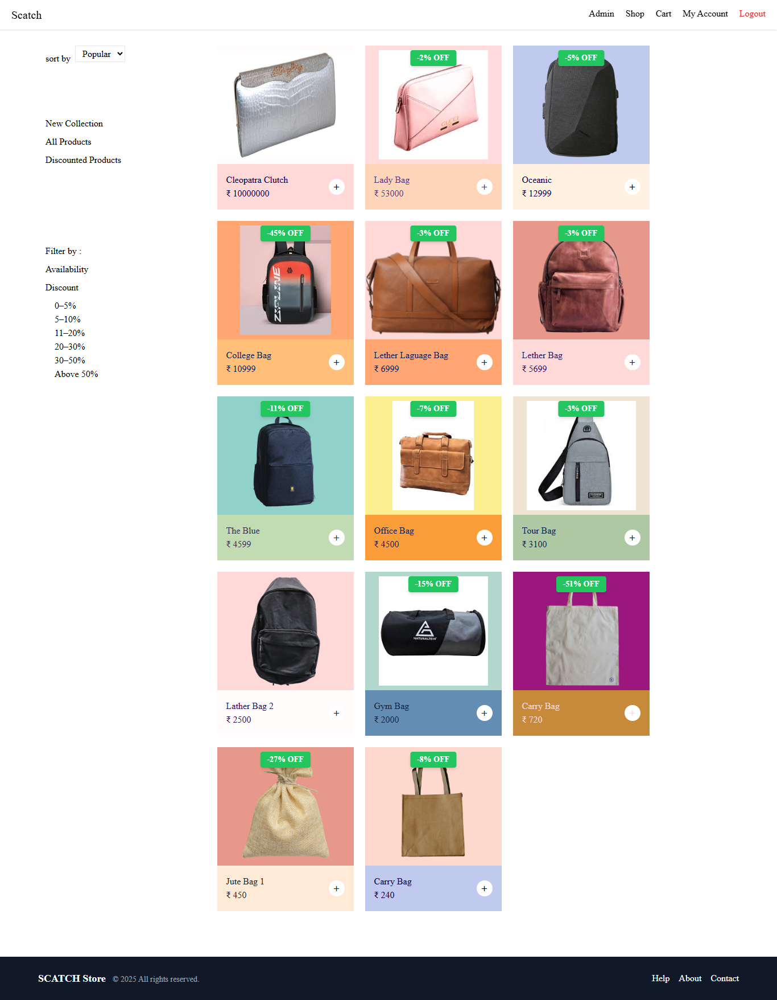
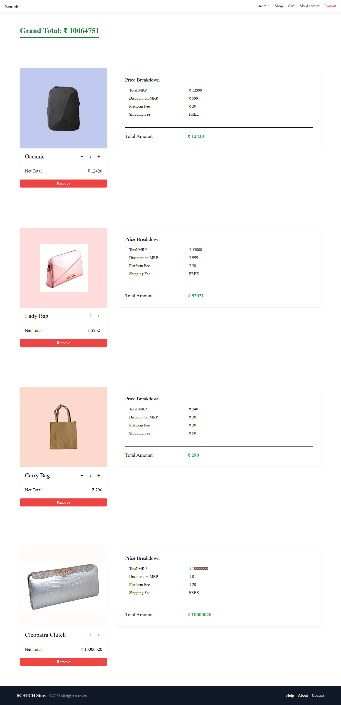
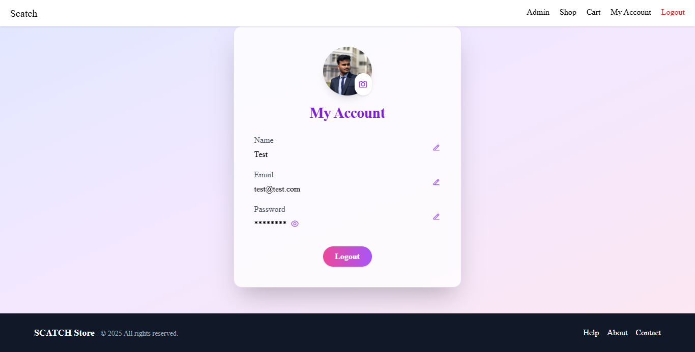
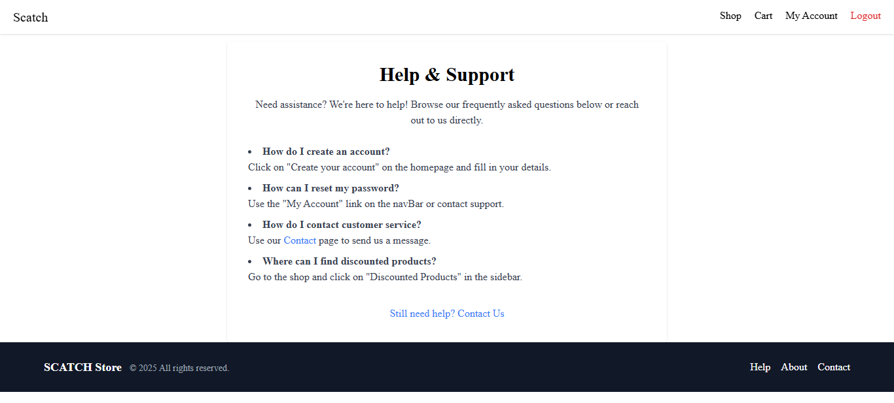
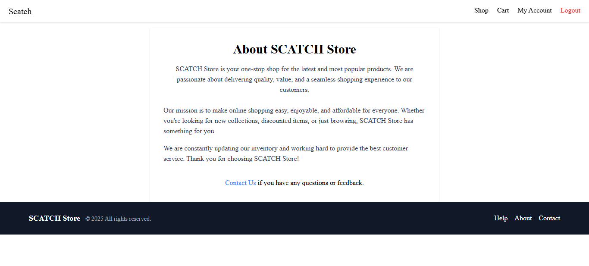
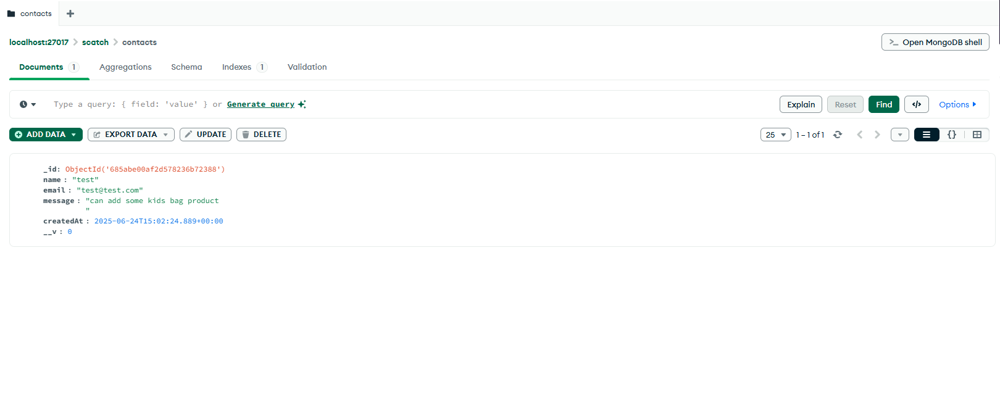
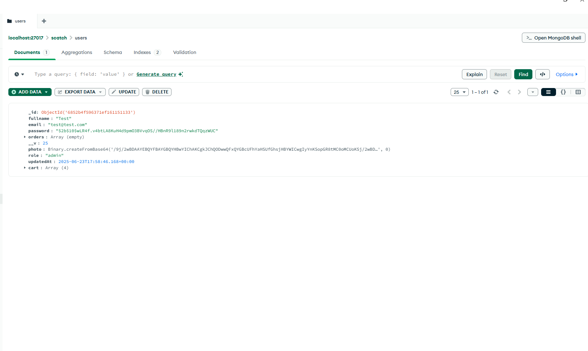

# 🎒 SCATCH - Bag Selling Website

Scatch is a full-featured e-commerce web application for buying and managing bags. Built using the MERN stack (MongoDB, Express.js, React, Node.js), this app includes user authentication, admin product management, cart functionality, and order breakdown — everything needed for a modern shopping experience.

## 🚀 Features

- 🛒 **Shop Page**: Browse all available products with categories and discounts.
- 🔐 **Authentication**: Register and login securely.
- 👤 **Account Page**: View and update user profile.
- 🧾 **Cart & Checkout**: Add items to cart and view detailed billing.
- 🛍️ **Admin Dashboard**: Create, update, or delete products.
- 📦 **Discount Logic**: Dynamic discount display and pricing logic.
- 🙋‍♂️ **Help & Support Page**: Common FAQs and support information.

## 🖥️ Tech Stack

- **Frontend**: React.js, Tailwind CSS / CSS
- **Backend**: Node.js, Express.js
- **Database**: MongoDB
- **Authentication**: JSON Web Token (JWT)

## 📸 Screenshots

### 👥 Create Account Page

### 🛠️ Admin Dashboard

### 🛍️ Shop Page

### 🛒 Cart Page

### 👤 My Account

### ❓ Help Page

### 📄 About & Contact Pages

### 🗂️ Contact Messages Database

### 🔐 Admin Role/User Management DB

SCATCH/
├── client/ # React frontend
│ ├── public/ # Static index.html, assets
│ └── src/
│ ├── assets/ # Images and icons
│ ├── components/ # UI: Navbar, ProductCard, CartItem, etc.
│ ├── context/ # AuthContext, CartContext providers
│ ├── hooks/ # Custom hooks (e.g., useAuth)
│ ├── pages/ # Shop, Cart, Admin, Account, Help, About, Contact
│ └── App.jsx # Root React component
├── server/ # Express backend
│ ├── controllers/ # Business logic handlers
│ ├── models/ # Mongoose schemas: User, Product, Contact
│ ├── routes/ # API endpoints for auth, cart, products, contact
│ ├── middleware/ # JWT auth, role checks, errors
│ └── server.js # Main Express app entry
├── .env # Sensitive config (MongoDB URI, JWT secret)
├── .gitignore # Ignored files and folders
└── README.md # Project documentation

/client # React frontend
/server # Express backend
/models # Mongoose models
/routes # Express API routes

## 🔧 Setup Instructions

1. **Clone the repo**:

   git clone https://github.com/abhradip001/SCATCH_ABHRADIP.git
   cd SCATCH_ABHRADIP
Install dependencies:

cd client
npm install
cd ../server
npm install
Set up environment variables:

Create a .env file inside /server with the following:

MONGO_URI=your_mongo_connection_string
JWT_SECRET=your_jwt_secret
PORT=5000
Run the app:

In one terminal:
cd server
npm run dev

In another terminal:
cd client
npm start

🔗 Live Demo
Coming soon / [Deploy your app and paste the link here]

🙌 Author
Abhradip Mandal
🔗 GitHub

